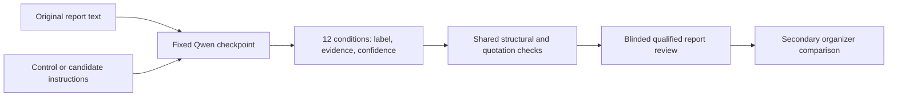

# Qwen report extraction v1 — local preparation

Current focus: **Qwen3-14B extracts structured findings from original-language knee reports**. MedGemma and MRI/YOLO development are paused. This package contains a completed saved-output audit and an unrun Qwen-only experiment proposal.

Read [RESULTS.md](RESULTS.md) for the measurements and [PROTOCOL.md](PROTOCOL.md) for the prospective design. The important finding is that changing quotation policy keeps historical technical acceptance at 58/60 but changes which cells pass. It does not improve the model or resolve medical interpretation.



The diagram describes the proposed future inference/review flow. Only local audit and prompt/token preparation have run. Output states remain positive, negative, uncertain and not_mentioned. Technical failure is separate, with no accepted label.

## Files and reproduction

- [local_audit.py](local_audit.py): no model backend, provider actions, generation or execution command.
- [experiment config](configs/experiment.json): pinned model and proposed 20-generation order, execution disabled.
- [prompt diff](configs/prompt_diff.json): exact source hashes, full textual changes and substantive categories.
- [control prompt](prompts/control.txt), [candidate prompt](prompts/candidate.txt): byte-identical copies of existing v1/v2 Qwen instructions, with corresponding definition files.
- [aggregate results](aggregate/summary.json): safe counts, provenance and token sizing; no reports or study IDs.
- [protected history](protected_history.json): hashes for 189 historical analysis files.
- [synthetic tests](../../tests/test_qwen_local_audit.py): integrity and parser-policy counterexamples.

Restore the existing private state and tokenizer cache first. Use the [pinned runtime dependencies](../report_labeling_llm_v2/configs/runtime.json); a default MRI training environment may have different Transformers pins. The completed local audit used Python 3.12 and CPU PyTorch 2.8.0. Run from the repository root:

```bash
export RSNA_STATE_DIR=/path/to/private/rsna-state
python analysis/qwen_report_extraction_v1/local_audit.py \
  --state-dir "$RSNA_STATE_DIR" \
  --cache "$RSNA_STATE_DIR/cache/tokenizer-preflight" \
  --output "$RSNA_STATE_DIR/runs/qwen-local-NEW"
```

The script refuses existing output directories. Omitting `--cache` runs the saved-output audit without tokenization and clearly records `NOT_PERFORMED`; it does not download missing assets. The cache must already have the exact Qwen snapshot. The original source CSV is checked as opaque bytes, the development inputs and split are verified, and validation reports are not opened. Existing analyst-review rows contain historical reference values; no new organizer evaluation is performed.

Private outputs include inputs/review context, exact saved responses, diagnostic source spans, both prompt sets, newly tokenized input IDs, and checksummed receipts. Store them under ignored state and private backups. The original v1 per-call token IDs were not recorded; matching reconstructed text/counts is not an original-ID roundtrip.

```bash
PYTHONPATH=src .venv/bin/python -m pytest -q tests/test_qwen_local_audit.py
```

No model weights, HF cache, report examples, study-level results or credentials are published. This text model's report extraction does not establish an MRI image teacher. [Browser review](REVIEW.md) is advisory, not clinical adjudication or compute authorization.
