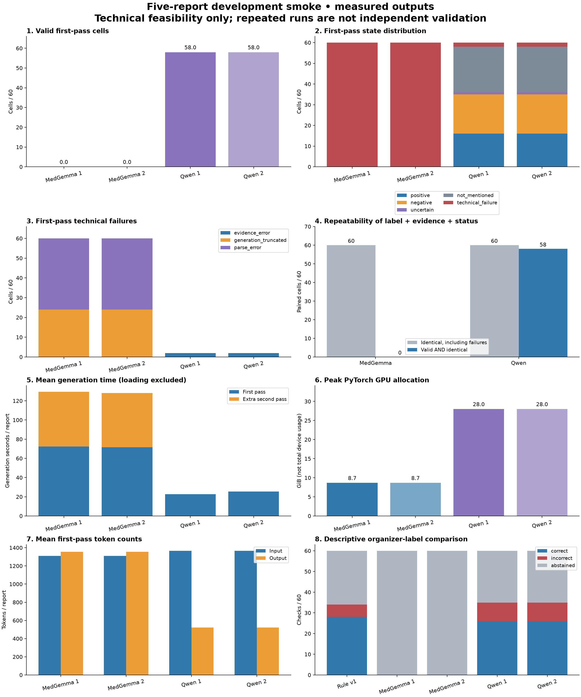

# Results — bounded development smoke

**Completed 2026-09-14: five development reports, two runs per model. Both prespecified all-valid repeatability gates failed. Do not scale the current recipe.** RunPod was stopped after approximately 35 minutes from the start attempt, within the approved one-hour stage. Compute was approximately **$0.93** at $1.59/hour, excluding storage; this is an estimate, not an invoice.

No full 40-study development inference, LLM inference on the 18-study validation partition, MRI training, or extraction on the remaining 4,349 reports occurred. The original 40/18 split and frozen rule baseline are unchanged. Tokenizer preflight examined all 58 report inputs without evaluating their labels.

## Objective, input and output

The objective was to check that pinned MedGemma and Qwen models can extract reproducible, machine-readable labels from reports before spending more on development.

- **Input:** one original report, common instructions and 12 condition definitions, rendered through the model's chat template. The same first five entries in the original development input were used for both repeats/models: four English, one Spanish. No images, organizer labels or study identifiers enter the model prompt.
- **Output:** 12 entries with `label`, verbatim `evidence_text` and self-reported `confidence`. States are `positive`, `negative`, `uncertain`, `not_mentioned`. Negative requires explicit supporting text. `not_mentioned` is never changed to negative.
- **Technical failure:** a separate status with a null accepted label. Formatting failures reject the response; invalid evidence rejects its condition entry. Exact quoted text alone does not establish semantic correctness.
- **Comparison:** accepted binary outputs versus the organizer labels joined from the original `train.csv` for these same five studies. Organizer disagreement can reflect extraction, target-definition or report/reference issues; it is not automatically a clinically adjudicated model error.

The private review package provides report selection, all 12 references, rule v1 and both model repeats, evidence highlighting, raw responses and exact rendered prompts. Generate it with the [review tools](smoke_review_tools/README.md). Full reports and study-level outputs are excluded from this public repository.

## Measured first-pass results

Each model row has **five unique studies / 60 condition checks**. Repeats are not additional independent samples. “Valid” includes the two semantic abstention states; it does not mean a correct Yes/No decision.

| Extractor | Valid / 60 | Binary decisions | Reference matches | Reference mismatches | Semantic abstentions | Technical failures | Correct yield / 60 |
|---|---:|---:|---:|---:|---:|---:|---:|
| Rule v1, matched five studies | 60 | 34 | 28 | 6 | 26 | 0 | 46.7% |
| MedGemma, run 1 | 0 | 0 | 0 | 0 | 0 | 60 | 0% accepted |
| MedGemma, run 2 | 0 | 0 | 0 | 0 | 0 | 60 | 0% accepted |
| Qwen, run 1 | 58 | 35 | 26 | 9 | 23 | 2 | 43.3% |
| Qwen, run 2 | 58 | 35 | 26 | 9 | 23 | 2 | 43.3% |

Conditional reference agreement is 28/34 (82.4%) for the rule baseline and 26/35 (74.3%) for Qwen; it is **undefined** for MedGemma because it has no accepted decisions. Qwen's states per repeat are 16 positive, 19 negative, 1 uncertain and 22 not mentioned. These descriptive development counts do not establish a clinical ranking, statistical superiority, calibrated confidence, or weak-label readiness. The frozen rule extractor retains its own existing text normalization; it was not retrofitted with the LLM exact-span validator. This compares complete extraction pipelines, including their different acceptance rules.

[PDF dashboard](aggregate/smoke_dashboard.pdf) · [complete metrics](aggregate/smoke_metrics.csv) · [execution provenance](aggregate/smoke_execution.json)

## Format, secondary generation and repeatability

MedGemma's first pass in each repeat had **36 parse-error cells (three reports)** and **24 generation-truncated cells (two reports)**. Three permitted secondary generations were attempted per repeat. The secondary result remained 0/60 accepted: 24 parse-error and 36 truncated cells. Secondary generation consumed approximately 44% of MedGemma's total generation time without producing accepted outputs. It is a new generation, not a neutral repair of formatting.

Qwen produced two `evidence_error` cells per repeat, both in the Spanish report. No secondary generation was attempted because this policy does not retry evidence failures. Its primary and secondary tables are consequently identical.

For both models, 5/5 raw first responses were byte-identical across repeats, and 60/60 status/label/evidence combinations matched **including failures**. Only 0/60 MedGemma and 58/60 Qwen cells were both valid and identical. Both fail the predeclared requirement for all 60 first-pass cells to be valid and repeatable. A zero process exit code from the repeatability command means its report was written; acceptance is determined by the report's `passed: false`. [Repeatability counts](aggregate/smoke_repeatability.json)

No code fences were removed or JSON substrings accepted when computing these metrics. The executed scripts, prompts, configs, protocol and benchmark tests retain the fingerprints recorded at commit `f33495873f85d7b83480c7a65776c9cbea664fb5`.

## Per-condition descriptive comparison

Counts below are per five studies, using the first repeat. The second repeat is identical. MedGemma has five technical failures for **every** condition and zero accepted binary decisions.

| Condition | Rule decided / matched | Qwen decided / matched | Qwen mismatches | Qwen technical failures |
|---|---:|---:|---:|---:|
| ACL | 4 / 4 | 4 / 3 | 1 | 0 |
| MCL | 5 / 5 | 4 / 4 | 0 | 0 |
| Medial Meniscus | 4 / 4 | 4 / 4 | 0 | 1 |
| Lateral Meniscus | 4 / 2 | 4 / 2 | 2 | 0 |
| Medial OA | 2 / 2 | 1 / 1 | 0 | 1 |
| Lateral OA | 1 / 1 | 2 / 1 | 1 | 0 |
| PF OA | 2 / 2 | 3 / 2 | 1 | 0 |
| Effusion | 4 / 2 | 5 / 3 | 2 | 0 |
| Synovitis | 2 / 1 | 2 / 1 | 1 | 0 |
| Baker's | 2 / 2 | 2 / 2 | 0 | 0 |
| Contusion | 2 / 1 | 1 / 1 | 0 | 0 |
| Fracture | 2 / 2 | 3 / 2 | 1 | 0 |

[All per-condition counts and confusion cells](aggregate/smoke_per_condition.csv). No condition has enough independent evidence for deployment or high-confidence weak labeling.

## Agreement and language

Any binary intersection requiring MedGemma accepts **0/60** cells; matching failures are not votes. Rule v1 and Qwen both make binary decisions on 26 cells, disagree on one, and agree on 25. Those 25 agreements contain **20 reference matches and five mismatches**: 41.7% coverage, 33.3% correct yield and 80% conditional agreement. This observed selection does not demonstrate an improvement over the matched rule baseline. Agreement can retain shared errors. Primary and secondary intersection results are identical. The fifth planned strategy, rule agreement with at least one LLM, reduces to rule/Qwen agreement here because MedGemma has no accepted binary outputs. [Agreement table](aggregate/smoke_agreement.csv)

| Language | Unique studies / checks | Rule decided / matched | Qwen valid | Qwen decided / matched | Qwen failures |
|---|---:|---:|---:|---:|---:|
| English | 4 / 48 | 26 / 22 | 48 | 31 / 25 | 0 |
| Spanish | 1 / 12 | 8 / 6 | 10 | 4 / 1 | 2 |

MedGemma has no valid outputs in either language. Both Qwen quotation errors replace source line breaks with spaces. The single Spanish case cannot distinguish a language effect from case content or formatting. No other languages were tested in this smoke, including the Bulgarian reports in the untouched validation input. [Language counts](aggregate/smoke_language.csv)

## Offline diagnostic and error review

This post hoc review used saved outputs only and **did not change accepted predictions or any smoke metric**. Categories are analyst hypotheses against the written protocol, not clinical adjudications.

MedGemma had **two**, not three, outer-fence-only first responses per repeat. Both become JSON after removing just the outer wrapper, but only one passes all schema/evidence checks; the other has one newline-related evidence error. Another completed response contains explanatory text around JSON. One truncated response never completes a 12-condition object; the other contains one earlier object before a later incomplete repetition. No substring was promoted to a prediction. [Diagnostic counts](aggregate/smoke_format_diagnostic.json)

Syntax is not the only MedGemma problem. Inspection of rejected fenced responses found a positive label supported by a normal-meniscus statement, wrong-compartment evidence, an effusion severity inconsistency and an unsupported synovitis negative. Even perfect serialization would require semantic review.

All nine Qwen binary mismatches, its two quotation failures and the one uncertain output were reviewed privately. Tentative categories among the nine mismatches are four report/reference disagreements, two compartment errors, one unspecified-severity error, one threshold/reference disagreement, and one contradictory-report/timing issue. Its uncertain Baker-cyst output quotes a different structure, adding another compartment issue outside the binary mismatch count. Several report statements support the extraction despite the organizer disagreement; forcing those answers to match the reference would conceal ambiguity. [Error-category counts](aggregate/smoke_error_categories.csv)

## Historical validation and limitations

The **previously published rule-only 18-study result** remains 92 decisions / 216 checks, 87 matches, five mismatches and 124 semantic abstentions: 42.6% coverage, 94.6% conditional agreement and 40.3% correct yield. [Historical baseline metrics](aggregate/baseline_reference_metrics.csv). Do not compare that 18-study score directly with the five-study smoke. There are **no LLM validation scores**.

The exact 40/18 assignment was retained. No validation label was used to change this run's prompts or decoding. The 18-study set was inspected historically, so a later reuse would be exploratory rather than fresh validation. Tiny condition and language denominators, correlated cells within studies, unequal model size, possible public-data pretraining exposure and report/reference ambiguity all limit inference. No confidence interval or significance claim is presented for this five-case engineering check.

## Recommendation

Keep full-development inference, validation, bulk extraction and MRI training paused. A separately versioned development candidate is worth designing locally: prospective narrow outer-fence handling, exact evidence-span handling and general anatomy/severity safeguards. Fence removal alone is insufficient; do not broadly extract arbitrary JSON substrings or silently reinterpret v1 failures. Any future prompt change must address a general failure mode rather than memorize these five references.

Before another paid stage, review the candidate protocol and synthetic edge cases. Before full development, require all 60 smoke cells to be technically usable under the predeclared policy, no truncation/context/OOM failures, exact repeatability, no unexplained evidence errors and a semantic review without obvious regression. These are engineering gates, not independent clinical validation. More adjudicated annotation and fresh evaluation remain necessary before scaling.

The [ChatGPT review record](REVIEW.md) is advisory and does not authorize further compute. The [resource record](RESOURCES.md) contains measured runtime, checkpoint identifiers and environment details. The frozen baseline remains untouched.

## Verification

The local full suite passed **84 tests**; the isolated GPU host passed **38 benchmark CPU tests** before inference. Four saved run manifests passed current fingerprint verification; independent checks reconciled all nine aggregate rows, the identical five-study membership and accepted evidence offsets. The browser viewer was checked for report/variant selection, 12 rows and seven comparison columns, evidence highlighting and raw-response expansion, with no browser console errors. Frozen source hashes and the source/split fingerprints were preserved. Public publication checks include diff review, staged-secret/data scans and Markdown-link verification.
